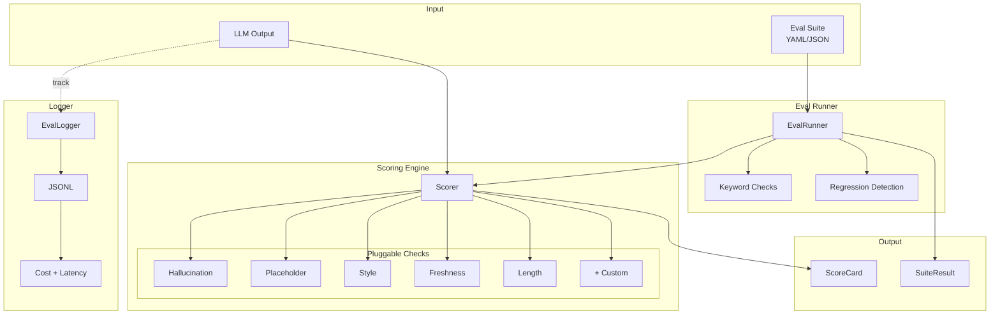

<div align="center">

```
██╗     ██╗     ███╗   ███╗
██║     ██║     ████╗ ████║
██║     ██║     ██╔████╔██║
██║     ██║     ██║╚██╔╝██║
███████╗███████╗██║ ╚═╝ ██║
╚══════╝╚══════╝╚═╝     ╚═╝
███████╗██╗   ██╗ █████╗ ██╗         ██╗  ██╗██╗████████╗
██╔════╝██║   ██║██╔══██╗██║         ██║ ██╔╝██║╚══██╔══╝
█████╗  ██║   ██║███████║██║         █████╔╝ ██║   ██║
██╔══╝  ╚██╗ ██╔╝██╔══██║██║         ██╔═██╗ ██║   ██║
███████╗ ╚████╔╝ ██║  ██║███████╗    ██║  ██╗██║   ██║
╚══════╝  ╚═══╝  ╚═╝  ╚═╝╚══════╝    ╚═╝  ╚═╝╚═╝   ╚═╝
```

# LLM Eval Kit 🧪

[](https://github.com/kustonaut/llm-eval-kit/actions/workflows/ci.yml)
[](https://www.python.org/downloads/)
[](https://opensource.org/licenses/MIT)
[](https://pypi.org/project/llm-eval-kit/)
[](https://kustonaut.github.io/llm-eval-kit)

**Stop shipping vibes. Start shipping quality.**

Quality scoring, golden test suites, and regression detection for LLM outputs.

[**🎮 Live Demo**](https://kustonaut.github.io/llm-eval-kit) · [**📦 PyPI**](https://pypi.org/project/llm-eval-kit/) · [**🤝 Contributing**](CONTRIBUTING.md)

</div>

---

## The Problem

You changed a prompt. Did the output get better or worse?

```
Before:  "Summarize Q4 results"  →  Clean, factual 200-word summary
After:   "Summarize Q4 results"  →  "I'd be happy to help! According to Smith et al..."

What happened?  ¯\_(ツ)_/¯
```

Most teams evaluate LLM output by reading it. That doesn't scale. It doesn't catch regressions. It doesn't measure quality over time.

**LLM Eval Kit brings testing discipline to AI workflows.**

---

## Features

| | Feature | What It Does |
|---|---------|-------------|
| 🎯 | **Quality Scoring** | 5 built-in checks: hallucination, placeholder, style, freshness, length |
| 🧪 | **Golden Test Suites** | Define expected keywords, banned phrases, min scores in YAML |
| 📉 | **Regression Detection** | Compare runs against baselines — catch quality drops before users do |
| 📝 | **Call Logging** | JSONL logger with prompt, response, model, latency, tokens, cost |
| 💰 | **Cost Tracking** | Per-call and aggregate token/cost/latency metrics |
| 🔌 | **Pluggable Checks** | Add custom checks in minutes — subclass `Check`, implement `run()` |
| ⚙️ | **CLI** | `llm-eval score`, `llm-eval eval`, `llm-eval costs` |
| 🤖 | **Model Agnostic** | Works with any LLM — OpenAI, Anthropic, local models, or pre-computed responses |

---

## Quick Start

```bash
pip install llm-eval-kit
```

### Score a single output

```python
from llm_eval_kit import Scorer

scorer = Scorer()
result = scorer.score("""
Revenue grew 15% in Q4, driven by cloud services.
Cloud platform revenue increased 29% year over year.
""")
print(result)
# ScoreCard: 0.95 [PASS] (5/5 checks passed)
#   [PASS] hallucination: 1.00
#   [PASS] placeholder: 1.00
#   [PASS] style: 1.00
#   [PASS] freshness: 1.00
#   [PASS] length: 0.76
```

### Catch bad output

```python
result = scorer.score("""
I'd be happy to help! According to Smith et al. (2019),
the results for {{QUARTER}} showed [TBD] improvement.
Please verify this with the original source.
""")
print(result)
# ScoreCard: 0.47 [FAIL] (1/5 checks passed)
#   [FAIL] hallucination: 0.77 — Hedging marker, fabricated citation
#   [FAIL] placeholder: 0.60 — Template variable: {{QUARTER}}, TBD marker
#   [FAIL] style: 0.93 — AI tell: 'I'd be happy to'
#   [PASS] freshness: 1.00
#   [FAIL] length: 0.06 — Too short: 32 words
```

### Run an eval suite

```yaml
# eval_suite.yaml
name: "My Quality Suite"
cases:
  - name: "clean_summary"
    prompt: "Summarize today's priorities"
    response: "Three priorities today: ship the API, fix the build, prep for demo."
    expected_keywords: ["priorities"]
    banned_keywords: ["I'd be happy to"]
    min_score: 0.7
```

```bash
llm-eval eval eval_suite.yaml --save baseline.json
# Suite: My Quality Suite — 1/1 passed (100%), avg score: 0.92

# Later, after prompt changes:
llm-eval eval eval_suite.yaml --baseline baseline.json
# ⚠️ REGRESSIONS DETECTED: clean_summary
```

### Log and track costs

```python
from llm_eval_kit import EvalLogger

logger = EvalLogger("my_run.jsonl")

with logger.track("gpt-4o", temperature=0.2) as call:
    call.prompt = "Summarize this document..."
    call.response = my_llm_call(call.prompt)  # your LLM function
    call.input_tokens = 500
    call.output_tokens = 150
    call.cost_usd = 0.003

print(logger.summary())
# {'total_calls': 1, 'total_tokens': 650, 'total_cost_usd': 0.003, ...}
```

```bash
llm-eval costs my_run.jsonl
# Total calls:    1
# Total tokens:   650
# Total cost:     $0.0030
# Avg latency:    342ms
```

---

## Built-in Checks

| Check | What It Detects | Default Threshold |
|-------|----------------|-------------------|
| `HallucinationCheck` | Hedging phrases ("I'm not sure"), fabricated citations ("Smith et al."), knowledge cutoff references | 1.0 (no markers) |
| `PlaceholderCheck` | `{{VARIABLES}}`, `[TBD]`, `[TODO]`, `Lorem ipsum`, `<YOUR ...>` | 0 placeholders |
| `StyleCheck` | AI tells: "I'd be happy to", "Certainly!", "delve", "landscape of", "tapestry" | 0 AI tells |
| `FreshnessCheck` | Stale year references, outdated "as of" dates | Current year - 1 |
| `LengthCheck` | Too short (<10 words) or too long (>5000 words) | 10-5000 range |

### Add a custom check

```python
from llm_eval_kit.checks.base import Check, CheckResult

class ProfanityCheck(Check):
    name = "profanity"

    def run(self, text: str, **context) -> CheckResult:
        bad_words = ["damn", "hell"]  # your list
        found = [w for w in bad_words if w in text.lower()]
        return CheckResult(
            name=self.name,
            passed=len(found) == 0,
            score=1.0 if not found else 0.0,
            findings=[f"Found: {w}" for w in found],
        )

scorer = Scorer(checks=[ProfanityCheck(), ...])
```

---

## Architecture



See [docs/architecture.md](docs/architecture.md) for detailed design, data flow sequence diagrams, and check lifecycle.
```

---

## CLI Reference

```bash
# Score text directly
llm-eval score "Your LLM output here..."

# Score from file
llm-eval score --file output.txt

# Score from pipe
echo "Your output" | llm-eval score

# Run eval suite
llm-eval eval suite.yaml

# Run with baseline comparison
llm-eval eval suite.yaml --baseline previous_run.json --save current_run.json

# View cost summary
llm-eval costs eval_log.jsonl

# JSON output
llm-eval score --json-output "Your text here"
llm-eval eval suite.yaml --json-output
```

---

## Why Not [existing tool]?

| Tool | Gap |
|------|-----|
| LangSmith | Requires LangChain dependency. Enterprise pricing. |
| promptfoo | Node.js. Config-heavy. Built for prompt engineering, not quality assurance. |
| OpenAI Evals | OpenAI-only. Research-oriented, not production-oriented. |
| **LLM Eval Kit** | Python-native. Zero LLM dependencies for scoring. Model-agnostic. PM-friendly. 5 checks out of the box. YAML test suites. Regression detection. CLI. |

---

## Ecosystem

`llm-eval-kit` is part of the [PM Intelligence](https://github.com/kustonaut) toolkit:

| Repo | What It Does |
|------|-------------|
| [issue-sentinel](https://github.com/kustonaut/issue-sentinel) | AI-powered GitHub issue triage |
| [github-issue-analytics](https://github.com/kustonaut/github-issue-analytics) | Visual analytics for GitHub issue data |
| [pm-signals](https://github.com/kustonaut/pm-signals) | Multi-source signal aggregation |
| **llm-eval-kit** | Quality scoring and eval suites for LLM outputs |

---

## Development

```bash
git clone https://github.com/kustonaut/llm-eval-kit.git
cd llm-eval-kit
pip install -e ".[dev]"
pytest --tb=short -q
ruff check src/ tests/
```

---

## License

MIT — see [LICENSE](LICENSE).

---

<div align="center">

Built by [Akshay Dixit](https://github.com/kustonaut) — because "it looks fine" isn't a quality bar.

</div>
