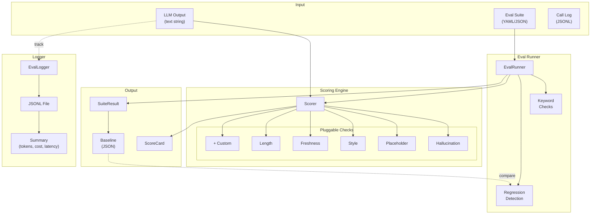
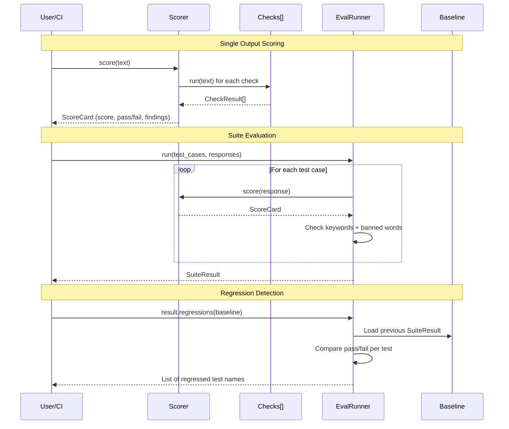
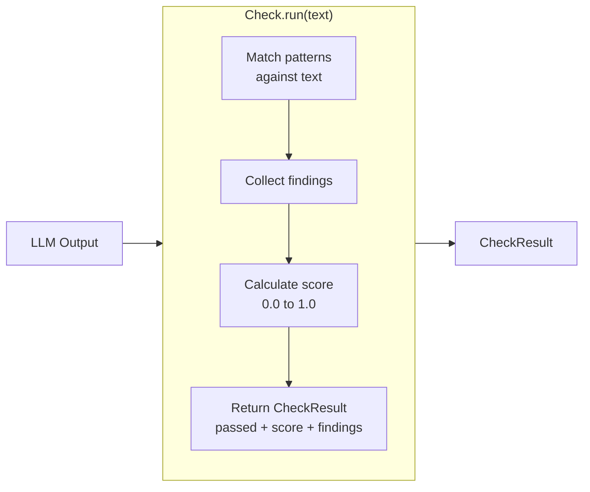

# Architecture

## Design Principles

1. **Zero LLM dependencies for scoring** — You don't need an API key to evaluate text. All built-in checks are regex/rule-based.
2. **Pluggable checks** — Subclass `Check`, implement `run()`, done. No framework lock-in.
3. **YAML-first test suites** — Define golden test cases in YAML, not code. PMs can write eval suites without Python knowledge.
4. **Regression-aware** — Every eval run can be compared against a baseline. Quality drops are caught before production.
5. **Model-agnostic** — Works with pre-computed responses, any LLM API, or local models. The scorer doesn't care where the text came from.

## Component Overview



## Data Flow



## Check Lifecycle



## Check Interface

Every check implements:

```python
class Check(ABC):
    name: str

    def run(self, text: str, **context) -> CheckResult:
        # context may include: prompt, model, temperature, metadata
        ...
```

Returns:
- `CheckResult.passed: bool` — binary pass/fail
- `CheckResult.score: float` — 0.0 (worst) to 1.0 (best)
- `CheckResult.findings: list[str]` — human-readable issues found

## Scoring

The `Scorer` averages all check scores for an `overall_score`. A configurable `threshold` (default 0.7) determines the overall pass/fail.

## Eval Runner

The `EvalRunner` adds:
- **Expected keywords** — test case must contain these words
- **Banned keywords** — test case must NOT contain these words
- **Regression detection** — compare `SuiteResult` against a previous `SuiteResult`

## Storage

- **Eval logs**: JSONL (one line per LLM call) — append-only, grep-friendly
- **Suite results**: JSON — for baseline comparison
- **Test suites**: YAML/JSON — human-editable
